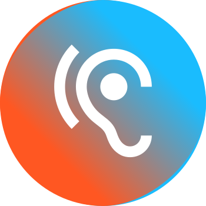

    

    
<strong>Audidroid</strong>

    
A audio recorder for researchers

    

---

Audidroid serves researchers and scientists as a digital audio recorder for case studies.
The focus lies on interviews and voice notes.
Audidroid shines with features specifically designed for this use case.
Other than the pure audio recording, you can also mark important positions while recording and edit files directly in the app.

Technical information for Audidroid can be found [here](./docs/Setup.md), and a detailed overview of the requirements context can be found [here](./docs/Overview.md).
Initial mockups and requirements for the app can be found [here](./requirements/mockups), tests of comparable existing apps can be found [here](./requirements/app-tests), and interviews with potential users can be found [here](./requirements/interviews).

## Team

Sabine Roth, sabine.roth@stud.uni-regensburg.de, @SabiRoth

Jonas Puchinger, jonas.puchinger@stud.uni-regensburg.de, @JonasPuchinger

Theresa Strohmeier, theresa.strohmeier@stud.uni-regensburg.de, @TheresaStrohmeier

## Description

The following features are implemented:

**Core features**

- Recording of audio files, optimized for spoken language. Important points can be marked during recording.

- Saving of the recordings at any storage location, with configurable names and labels.

- Searchable, filterable and sortable view of all recorded files. File organisation via custom folder structures.

- Playback of recorded files. Skipping forward and backward, or also to marked positions. Changing the playback speed.

- Sharing of recordings to other apps, and conversion to different audio formats.

- Cutting of recordings, and editing of labels and marks.

- Navigation within the app via a NavigationDrawer.

**Settings**

- Definition of markers, to use for annotating recordings.

- Definition of labels, to use for file organisation.

- Definition of a standard filename template.

- Selection of the preferred storage location on the device.

- Selection of the preferred color theme (available: light and dark).

- Rotate screen to improve audio quality of recording (microphone faces interviewee, user interface faces interviewer).
