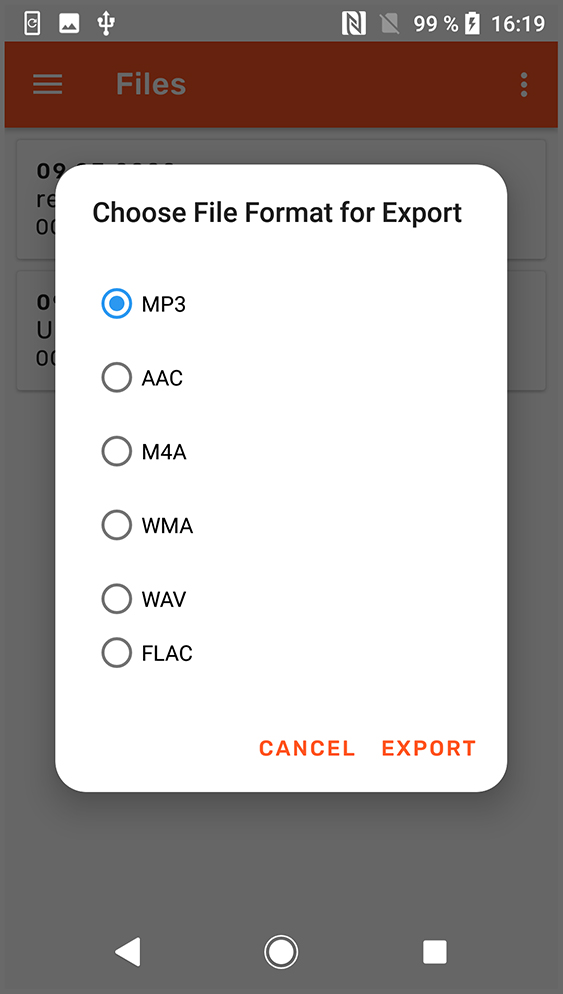
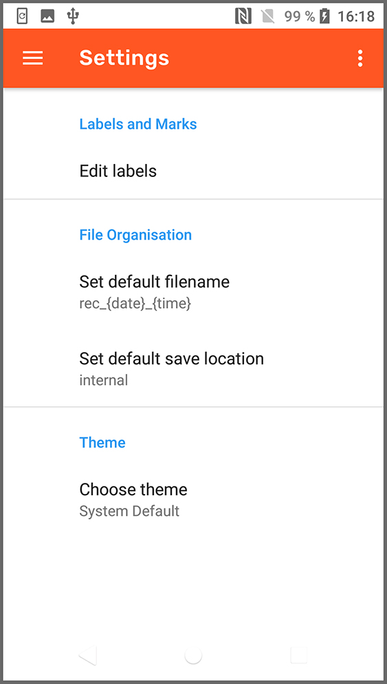

# Audidroid

Audidroid dient ForscherInnen und WissenschaftlerInnen als digitales Tonbandgerät für Feldstudien. 
Der Fokus liegt hierbei auf Interviews und Sprachnotizen. 
Audidroid zeichnet sich durch Features aus, die speziell für diesen Anwendungsfall konzipiert sind. 
Dazu gehören neben dem reinen Aufnehmen von Audiodateien auch das Markieren wichtiger Stellen in den Dateien direkt in der App.

Technische Informationen zu Audidroid finden sich [hier](./docs/Setup.md), eine detaillierte Übersicht über den Anforderungskontext findet sich [hier](./docs/Overview.md).

## Team

Sabine Roth, sabine.roth@stud.uni-regensburg.de, @SabiRoth

Lisa Sanladerer, lisa.sanladerer@stud.uni-regensburg.de, @sanlalala

Jonas Puchinger, jonas.puchinger@stud.uni-regensburg.de, @JonasPuchinger

Theresa Strohmeier, theresa.strohmeier@stud.uni-regensburg.de, @TheresaStrohmeier

## Beschreibung

Aktuell sind folgende Features in Audidroid implementiert:

**Kernfeatures**

- Aufnahme von Audiodateien mit Optimierung von gesprochener Sprache. Während der Aufnahme können relevante Stellen markiert werden.

- Speichern der Aufnahme an einem beliebigen Speicherort mit bevorzugtem Namen und zugewiesenen Labels

- Auswählen der Aufnahme aus der Liste der eigenen Audiodateien

- Abspielen der aufgenommenen Audiodateien

- Export der Aufnahmen mit der Möglichkeit, in andere Dateiformate zu konvertieren

- Bearbeitung der Aufnahmen mit Möglichkeiten zum Zuschneiden der Audiodateien, sowie Editieren von Labels und Markierungen.

- Navigation in der App mit Hilfe eines Navigation Drawers

**Einstellungen**

- Definition von Labels, die später den Aufnahmen zugewiesen werden können

- Definition des gewünschten Standarddateinamens

- Auswahl des präferierten Speicherorts auf dem Gerät

- Auswahl des präferierten Farbschemas (verfügbar: hell und dunkel)

